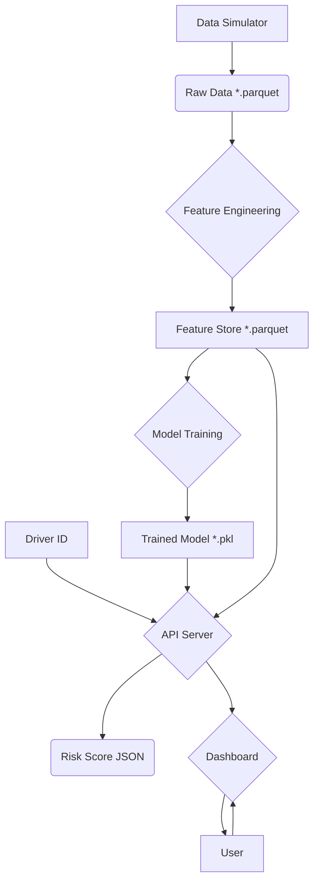

# Architecture

## System Overview

The system is designed as a modular pipeline that flows from data simulation to a user-facing dashboard.

1.  **Data Simulation**: Generates raw trip data.
2.  **Feature Engineering**: Cleans and transforms raw data into meaningful features.
3.  **Model Training**: Trains a GBDT model on the engineered features.
4.  **API Server**: Exposes a `/score` endpoint to provide real-time risk scores.
5.  **Dashboard**: A Streamlit application for visualizing scores and driver behavior.

## Mermaid Diagram

